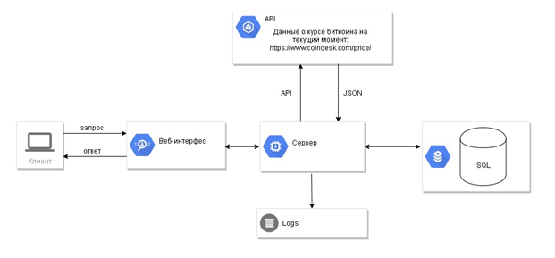
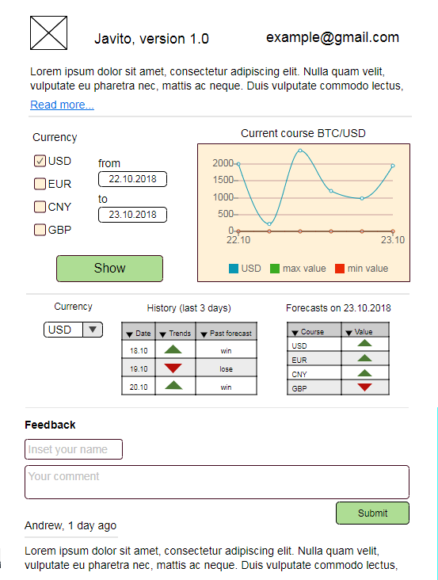

# Спецификация требований к приложению Javito

## 1. Назначение

Данная спецификация требований к ПО описывает функциональные и нефункциональные требования к приложению Javito версии 1.0. 
Этот документ предназначен для использования как на этапе разработки, так и на этапе проверки корректности работы системы (этап тестирования). Изменения требований к ПО должно быть отражено в соответствующей таблице (раздел 2, таблица 1).

## 2. История изменений документа

*Таблица 1. Модификация требований к ПО*

| Версия | Дата         | Описание                                                  |
| ------ |:------------:| :---------------------------------------------------------|
| 1.0    | 17.10.2018   | Начальная версия                                          |
| 1.1    | 18.10.2018   | Добавлено требование: возможность оставлять комментарии   |
| 1.2    | 20.10.2018   | Изменение требований в соответствии с замечаниями         |

## 3. Общее описание

### 3.1. Общий взгляд на продукт

Javito – информационно-справочная система, предназначенная для удобного анализа и предсказания динамики курса Bitcoin. 
Данные в системе обновляются с периодичностью один раз в день. Информация о текущем курсе Bitcoin предоставляется сервисом 
https://www.coindesk.com/price/. 

 

Рис. 1. Структура системы

### 3.2. Предложения и ограничения реализации

 * Серверная часть должна быть реализована на Java, не ниже 7 версии. Допускается использование языка Python для математических и наукоемких задач;

  * Код должен быть написан в едином стиле, с соблюдением практик и техник из Java Code Conventions, Clean code;
* Не требуется правильное отображение веб-интерфейса приложения на мобильных устройствах и планшетах;
* Требуется правильно отображение веб-интерфейса только в браузере Google Chrome;
* Обработка и отображение данных о Bitcoin в таких валютах как EUR, USD, CNY, GBP;
* Решение разрабатывается исключительно в учебных целях.
 
### 3.3. Бизнес-требования

  *	Приложение должно позволять пользователю наблюдать за динамикой курса Bitcoin;  
  *	Для пользователя данное приложение должно сэкономить время планирования покупки криптовалюты;  

## 4. Функциональные требования

### 4.1. Требования к пользовательскому интерфейсу
#### 4.1.1.  Визуализация данных в соответствии с заданными фильтрами

Пользователь может просматривать динамику курса Bitcoin в графическом виде. При этом пользователю доступен выбор фильтров, 
таких как: отображение графика за определенный период времени, отображение графика курса в другой валюте за день.  
Приоритет – высокий.                                  
                                    
*Таблица 2. Сценарии использования*

| Событие| Описание|
| ------ | :---------------------------------------------------------|
| Воздействие   |  Пользователь делает запрос на получение информации о курсе Bitcoin за определенный период времени. |
| Реакция    |  Система отображает данные в виде графика в специально отведенной области на странице сайта.   |
| Воздействие   |  Пользователь добавляет различные фильтры.|
| Реакция    |  В специально отведенной области на странице сайта происходят соответствующие изменения на графике.  |

#### 4.1.2. Добавление комментариев

Пользователь имеет возможность оставить комментарий.

Приоритет - средний
                                   
*Таблица 3. Сценарии использования*  

| Событие| Описание|
| ------ | :---------------------------------------------------------|
| Воздействие   | Пользователь в специально отведенной форме заполняет поля: имя (неуникальное), текст сообщения и нажимает кнопку «оставить отзыв».|
| Реакция    |  Система обрабатывает сообщение пользователя, сохраняет в базу данных и отображает на странице сайта.   |

#### 4.1.3. Отображение прогноза криптовалюты
При загрузке страницы сайта из базы данных извлекаются данные, которые отображаются в виде таблицы. 

Приоритет - высокий.
                                 
 *Таблица 4. Сценарии использования*
 
| Событие| Описание|
| ------ | :---------------------------------------------------------|
| Воздействие   | Загрузка страницы пользователем.|
| Реакция    |  Система отображает данные о криптовалюте в виде таблицы.  |

### 4.2. Требования к серверной части
#### 4.2.1. Прогноз курса криптовалюты Bitcoin
Пользователь может увидеть прогноз курса Bitcoin на следующий день. 
*Требования к алгоритмам предсказания курса Bitcoin уточняются.*

Приоритет – высокий.

*Таблица 5. Сценарии использования*

| Событие| Описание|
| ------ | :---------------------------------------------------------|
| Воздействие   | Воздействия от пользователя не требуется. (Вычисление прогноза происходит независимо от действий пользователя, в определенный момент времени).|
| Реакция    |  Отсутствует. Прогноз появляется в соответствующей области при загрузке страницы сайта.  |

#### 4.2.2. Запрос данных о курсе криптовалюты Bitcoin
Система раз в день запрашивает данные о курсе Bitcoin посредством API с [сайта](https://www.coindesk.com/price/ "https://www.coindesk.com/price/"). Время сбора данных 23.55 по МСК. 
Приоритет - очень высокий.

*Таблица 6. Сценарии использования*

| Событие| Описание|
| ------ | :---------------------------------------------------------|
| Воздействие   | Воздействие отсутствует. Сбор данных происходит один раз в час в автоматическом режиме.|
| Реакция    |  Обработка запрошенных данных (JSON-файл).  |

#### 4.2.3. Обработка JSON-файла
У CoinDesk существует несколько вариантов передачи своих данных в формате JSON: общий JSON-объект с данными всех валют в реальном времени; JSON-объект определенной валюты.
Для работы нашего сервиса будет использоваться JSON-объект первого типа, который доступен по URL: https://api.coindesk.com/v1/bpi/currentprice.json.
Объект состоит из времени последнего обновления данных, аббревиатуры валюты, ее расшифровки и ставки. 

Способ взаимодействия JSON-объекта с нашим сервисом на данный момент уточняется.

Приоритет – очень высокий.

*Таблица 7. Сценарии использования*

| Событие| Описание|
| ------ | :---------------------------------------------------------|
| Воздействие   | Отсутствует.|
| Реакция    |  Данные помещаются в БД.  |

#### 4.2.4. Учет действий системы (логирование)
Каждое действие пользователя и системы должно логироваться в специальный файл. 

Приоритет – низкий.

*Таблица 8. Сценарии использования*

| Событие| Описание|
| ------ | :---------------------------------------------------------|
| Воздействие   | Совершается любое действие пользователя (например, построение графика) или системы (например, автоматический сбор данных).|
| Реакция    | Система записывает совершенные действия в специальный файл.  |

### 4.3. Прототип системы и описание интерфейсов

Во время запуска сервиса по умолчанию отображается график котировок по отношению к USD. Если пользователь не выбрал ни одного из предложенных фильтров (USD, CNY, EUR, GBP), ему выводится пустой график.

 

Рис. 2. Прототип первоначальной версии пользовательского интерфейса

<ins>График изменений курса биткоина</ins>.

* Инструмент помогает отследить состояние курса биткоина по отношению к четырем валютам-фильтрам: USD, EUR, CNY и GBP;
* График строится за тот промежуток времени, который вводит пользователь в специальных графах выбора дат. Минимальный интервал отображения изменений - 1 день;
* Система определяет максимальное и минимальное значение курса биткоина за тот промежуток времени, который выбирает пользователь. Критические точки максимума и минимума графика окрашиваются в зеленый и красный цвет соответственно.

<ins>Таблица, которая отображает историю поведения курса биткоина и истинность алгоритма предсказания.</ins> 
История фиксируется за последние три дня в зависимости от валюты из выпадающего списка. Таблица состоит из трех столбцов: дата, направление динамики курса, и истинность предсказаний алгоритма. Если предсказания совпали с реальным поведением курса за определенный день, то выводится win, иначе - lose..

<ins>Таблица, которая прогнозирует поведение курса биткоина на следующий день. Состоит из 2-х столбцов</ins>:

* Валюта, для которой строится прогноз поведения;
* Прогноз роста/падения котировок на следующий календарный день. Зеленая стрелка сигнализирует о том, что алгоритм предсказывает рост курса, красная - его снижение.

<ins>На сайте системы любой пользователь может оставить свой  комментарий</ins>:

* Для публикации комментария необходимо ввести имя пользователя;
* Длина  комментария не превышает 500 символов;
* После публикации комментария, пользователь не имеет возможности удалять и изменять его;
* Комментарии отображаются для всех пользователей. 

## 5. Нефункциональные требования
### 5.1. Требования к производительности

* Система должна обслуживать одновременно до 10 пользователей, которые выполняют такие действия как: изменение параметров графика, написание комментариев;
* Время реакции на запросы пользователей не должно превышать 2 секунды.

### 5.2. Требования к безапасности

* Защита от XSS, в том числе, от SQL-инъекций;
* Ограничен доступ к лог файлу от пользователей. 
 
### 5.3. Требования к эргономике

* Интерфейс системы должен обеспечивать наглядное, интуитивно понятное представление структуры размещенной информации, быстрый и логичный переход к соответствующим разделам системы;
* Навигационные элементы интерфейса системы должны обеспечивать однозначное понимание пользователем их смысла и обеспечивать навигацию по всем доступным пользователю разделам системы и отображать соответствующую информацию;
* Интерфейс системы должен позволять решать задачи пользователя наиболее быстрым, простым и удобным из возможных способов; 
* Дизайн и удобство интерфейса должны быть на уровне ожиданий современного пользователя и восприниматься им как комфортная, удобная и приятная рабочая среда.

## 6. Обработка ошибок
### 6.1. Сервис с данными о курсе биткоина недоступен
При попытке пользователем зайти на сервис во время проведений технических работ, либо во время сбоя работы, система откроет новую страницу, где будут указаны причины отсутствия доступа к сервису.
### 6.2. Пустой комментарий
При попытке пользователем отправить пустой комментарий (или пользователь не указал имя), система вызовет исключение, которое выведет сообщение о некорректности ввода комментария.
### 6.3. Нет данных для вывода графика
При попытке пользователем ввести некорректный промежуток времени (ввод не наступившего промежутка времени) для вывода состояния 
курса биткоина в виде графика, система вызовет исключение, которое выведет сообщение об отсутствии данных за выбранный период. 

 

